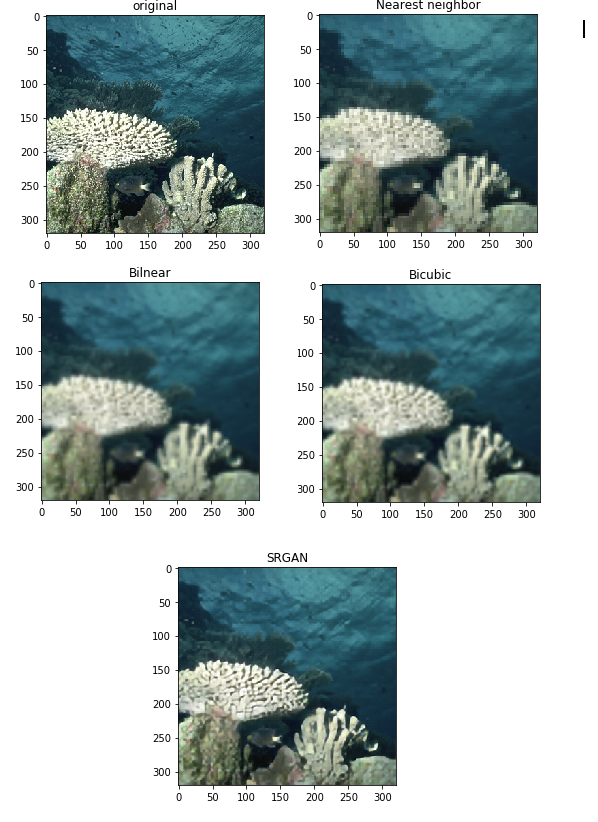

# srgan_pilot
This repo is filled with experimental stuff with SRGAN

`Hazard : do not touch!`

The code base consist of modifications on original SRGAN as proposed in **[Photo-Realistic Single Image Super-Resolution Using a Generative Adversarial Network](https://arxiv.org/abs/1609.04802)**. I have attempted to replace the vanilla GAN with the Wasserstein GAN. Things are unstable and changing rapidly at the moment. Clone at your own risk!

## Some results so far
To see more such outputs and comparison checkout the `analyse_BSD.ipynb` in the src folder



Visually outputs of srgan looks better than the other methods (these are 4X zoom). To see qauntitavely, I plotted the RRSME values for the results obtained by different methods for different images

```
blue: Nearest Neigh , green: Bilin , yellow: Bicubic , red: SRGAN
```


As discussed in the paper **RRMSE is not a good measure to capture the visual appeal of the image** that is it may happen that RRMSE values are low but the images are actually blurry and doesnt look great (happens most of the time). Here also it seems like there is a marginal reduction in RRMSE when using SRGAN, but visually it can be seen that there is a significant difference in the quality.

## References
* https://github.com/aitorzip/PyTorch-SRGAN
* https://arxiv.org/pdf/1609.04802.pdf
